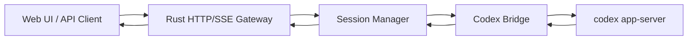

# Architecture

这个项目可以按运行时分成 5 个核心组件。

## Component Summary

## Components

| Component | 分工 | 关键文件 |
| --- | --- | --- |
| Web UI / API Client | 用户入口。负责创建 session、连接 SSE、发送 prompt、展示结果。Web UI 只是内置调试页面，外部业务系统也可以直接调用 HTTP API。 | `public/index.html`, `public/app.js` |
| Rust HTTP/SSE Gateway | 对外服务入口。负责 HTTP 路由、请求校验、健康检查、静态文件、SSE 输出。它不直接和 Codex 模型交互。 | `rust-src/main.rs` |
| Session Manager | 多会话管理。负责创建 session、查找 session、刷新 TTL、限制最大 session 数、清理过期 session、关闭 session 资源。 | `rust-src/session_manager.rs` |
| Codex Bridge | 协议桥。每个 session 一个 bridge，负责启动并管理对应的 `codex app-server` 子进程，通过 stdio 发送 `initialize`、`thread/start`、`turn/start` 等请求，并把 app-server 通知转成 gateway 状态。 | `rust-src/bridge.rs`, `rust-src/models.rs` |
| `codex app-server` | Codex 真正的运行体。负责 Codex thread、turn、模型调用和工具请求等底层逻辑。它是外部 `codex` CLI 提供的子进程，不是本仓库自己实现的模块。 | 由 `codex app-server` 命令启动 |

## Supporting Parts

除了 5 个核心组件，还有几个辅助模块：

| Part | 分工 | 关键文件 |
| --- | --- | --- |
| Auth | 可选 JWT 鉴权。设置 `CODEX_GATEWAY_JWT_SECRET` 后，普通 API 和 SSE 都需要 token。 | `rust-src/auth.rs` |
| Runtime / Env Config | 读取 `CODEX_GATEWAY_*` 配置，处理 API key 登录、base URL 覆盖、Codex 子进程环境变量。 | `rust-src/config.rs`, `rust-src/env_config.rs`, `rust-src/runtime.rs` |
| CLI Smoke Test | 本地一次性验证链路：启动 bridge、发 prompt、等待结果。 | `rust-src/cli.rs` |
| Docker / CI | 构建 Rust 二进制、安装 Codex CLI、发布容器镜像。 | `Dockerfile`, `.github/workflows/container.yml` |

## One Sentence

这个项目的核心分工是：

`Web UI / API Client` 负责输入输出，`Rust Gateway` 负责对外 API，`Session Manager` 负责多会话生命周期，`Codex Bridge` 负责协议转换和子进程管理，`codex app-server` 负责真正的 Codex 执行。
